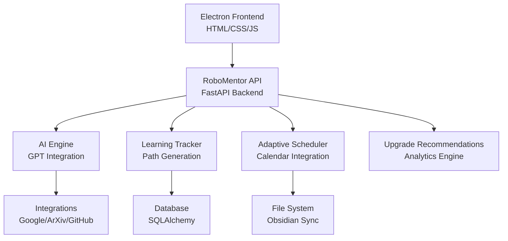
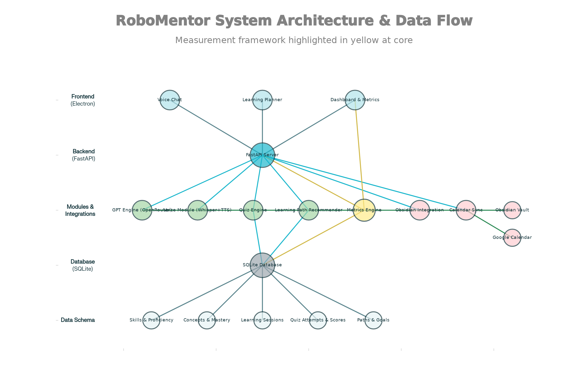
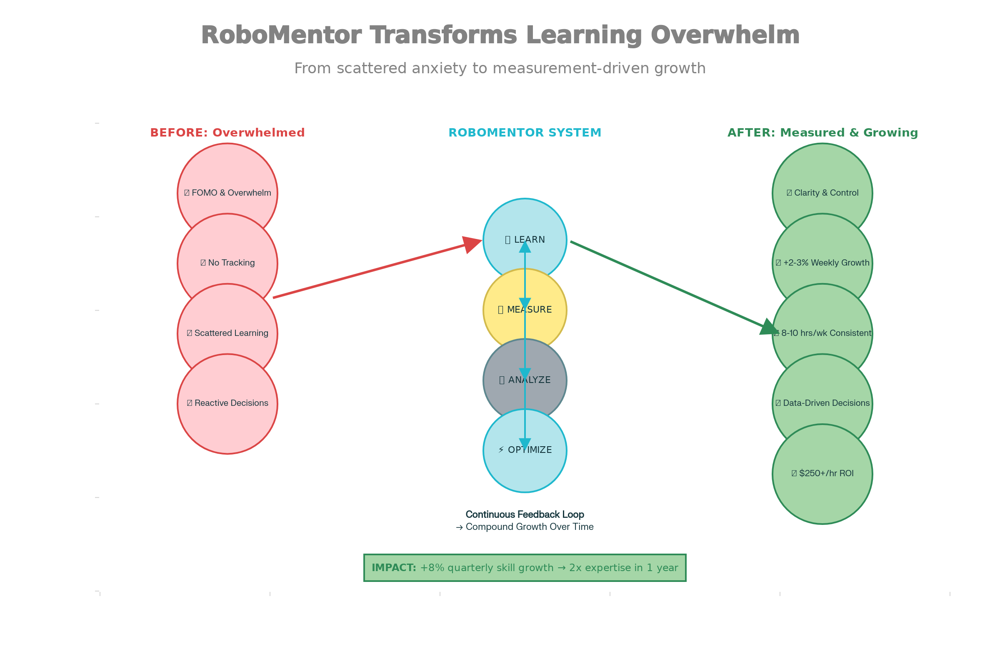

<div align="center">

# 🤖 RoboMentor

*AI-Powered Learning Platform for Robotics Engineers*


[](https://github.com/your-username/robomentor_app/actions/workflows/ci.yml)
[](https://opensource.org/licenses/MIT)
[](https://www.python.org/downloads/)
[](https://github.com/your-username/robomentor_app/releases)
[](https://github.com/your-username/robomentor_app/releases)
[](https://github.com/your-username/robomentor_app/stargazers)
[](https://github.com/your-username/robomentor_app/network/members)

*Revolutionize your robotics learning journey with personalized AI mentorship, adaptive scheduling, and cutting-edge trend integration—all in a secure, local-first environment.*

[🚀 Quick Start](#installation-and-setup) • [📖 Documentation](docs/) • [🤝 Contributing](#contributing) • [📄 License](#license)

</div>

---

## 📋 Table of Contents

- [✨ What is RoboMentor?](#-what-is-robomentor)
- [🚀 Key Features](#-key-features)
- [🏗️ Architecture Overview](#️-architecture-overview)
- [⚡ Quick Start](#-quick-start)
- [📦 Installation & Setup](#-installation--setup)
- [🎯 Usage Examples](#-usage-examples)
- [🔌 API Documentation](#-api-documentation)
- [📸 Screenshots](#-screenshots)
- [🤝 Contributing](#-contributing)
- [📄 License](#-license)

---

## ✨ What is RoboMentor?

**RoboMentor** is your intelligent companion in the world of robotics engineering! 🚀 This revolutionary AI-powered learning platform transforms how robotics professionals acquire and master complex skills. Built with a local-first architecture, it ensures your data stays private while providing seamless integrations with industry trends and calendar systems.

### 🎯 Why Choose RoboMentor?

- **🧠 AI-Powered Mentorship**: Get instant guidance from an AI mentor specialized in robotics
- **📈 Personalized Learning**: Adaptive paths that evolve with your progress and goals
- **⏰ Smart Scheduling**: Intelligent calendar integration for optimal learning sessions
- **📊 Real-Time Insights**: Track your growth with comprehensive analytics and recommendations
- **🔒 Privacy-First**: All your data stays local, with optional cloud integrations
- **🌟 Industry Trends**: Stay ahead with automated insights from ArXiv and GitHub

Whether you're a seasoned engineer looking to upskill or a newcomer navigating the robotics landscape, RoboMentor adapts to your needs and accelerates your professional development.

---

## 🚀 Key Features

### 🤖 AI-Powered Mentoring
- 💬 Interactive chat with robotics-specialized AI mentor
- 🎤 Voice input processing with speech-to-text integration
- 🎯 Context-aware responses tailored to your skill level and goals
- ❓ Instant answers to complex technical questions

### 📚 Personalized Learning Paths
- 🧪 AI-driven path generation based on your current skills and aspirations
- 📊 Phase-based progression with adaptive difficulty scaling
- 🔗 Obsidian vault integration for concept synchronization
- 📈 Real-time skill proficiency tracking and gap analysis

### 📅 Adaptive Scheduling
- 📆 Seamless Google Calendar integration
- 🧠 Smart algorithms that learn your availability patterns
- ⚡ Automatic conflict resolution and optimal time recommendations
- 📱 Cross-device synchronization

### 📊 Real-Time Analytics
- 📈 Learning velocity visualization and progress tracking
- 🔍 Comprehensive gap analysis reports
- 📊 Interactive dashboard with metrics and insights
- 🎯 Goal achievement monitoring

### 🌐 Trend Integration
- 📚 ArXiv integration for cutting-edge robotics research
- 💻 GitHub trending repositories monitoring
- 🤖 Automated content recommendations based on industry trends
- 📰 Weekly trend summaries and insights

### 🧠 Quiz & Assessment Engine
- 🎲 AI-generated quizzes with dynamic difficulty adjustment
- ✅ Real-time answer evaluation and instant feedback
- 📊 Progress tracking through detailed assessment results
- 🎓 Certification-ready evaluation system

---

## 🏗️ Architecture Overview

RoboMentor follows a modern desktop application architecture combining the power of Electron for the frontend with a robust Python FastAPI backend, all packaged for a seamless local-first experience.



### 🏛️ Core Components

- **🧠 AI Engine**: Advanced GPT integration, intelligent chat processing, and adaptive quiz generation
- **📚 Learning Tracker**: Sophisticated path creation, skill profiling, and goal management
- **⏰ Adaptive Scheduler**: Smart calendar coordination and session optimization
- **📈 Upgrade Recommendations**: Deep analytics and personalized improvement suggestions
- **🔗 Integrations**: Robust external API management for calendar, research, and development trends

For detailed architectural diagrams and component interactions, explore our visual documentation below.

---

## ⚡ Quick Start

Get RoboMentor up and running in minutes! Here's the express lane:

1. **📥 Clone & Setup**
   ```bash
   git clone https://github.com/your-username/robomentor_app.git
   cd robomentor_app
   ```

2. **🐍 Backend Launch**
   ```bash
   cd backend
   python -m venv venv && source venv/bin/activate
   pip install -r requirements.txt
   python main.py
   ```

3. **🖥️ Frontend Start**
   ```bash
   cd ../frontend
   npm install && npm start
   ```

4. **🎉 Explore!** Open your RoboMentor desktop app and start your learning journey!

*For detailed setup instructions, see [Installation & Setup](#-installation--setup) below.*

---

## 📦 Installation & Setup

### 📋 Prerequisites

- 🐍 Python 3.9 or higher
- 📦 pip package manager
- ☁️ Google Cloud Console account (for Calendar integration)
- 🔑 GitHub Personal Access Token (for trend monitoring)

### 🔧 Backend Setup

1. **📥 Clone the repository:**
   ```bash
   git clone https://github.com/your-username/robomentor_app.git
   cd robomentor_app
   ```

2. **🌐 Create virtual environment:**
   ```bash
   python -m venv venv
   source venv/bin/activate  # Windows: venv\Scripts\activate
   ```

3. **📦 Install dependencies:**
   ```bash
   cd backend
   pip install -r requirements.txt
   ```

4. **⚙️ Configure environment:**
   Create `.env` in `backend/`:
   ```env
   OPENAI_API_KEY=your_openai_api_key
   GOOGLE_CALENDAR_CREDENTIALS_PATH=path/to/credentials.json
   GITHUB_TOKEN=your_github_token
   DATABASE_URL=sqlite:///./robomentor.db
   HOST=localhost
   PORT=8000
   ```

5. **🗄️ Initialize database:**
   ```bash
   alembic upgrade head
   ```

6. **🚀 Launch server:**
   ```bash
   python main.py
   ```
   *API available at `http://localhost:8000`*

### 💻 Frontend Setup

1. **📦 Install dependencies:**
   ```bash
   cd frontend
   npm install
   ```

2. **🎯 Run application:**
   ```bash
   npm start
   ```

*RoboMentor desktop app launches with bundled backend!*

### 🧪 Testing

```bash
cd backend
python -m pytest tests/ -v
```

### 🚀 Deployment

For production builds and distribution, check out our comprehensive [BUILD_DEPLOYMENT.md](BUILD_DEPLOYMENT.md) guide covering:
- 🏗️ Standalone executable creation
- 📦 Cross-platform packaging (Windows/macOS/Linux)
- 🔐 Code signing and security
- 🔄 CI/CD pipeline examples

---

## 🎯 Usage Examples

### 🖥️ Application Usage

Once RoboMentor is running, dive into these core features:

1. **📊 Dashboard**: Monitor progress, view active goals, and track recent achievements
2. **💬 AI Chat**: Engage with your personal robotics mentor for guidance and answers
3. **📚 Learning Planner**: Define goals and explore your customized learning pathways
4. **⚙️ Settings**: Customize themes, notifications, and integration preferences

Enjoy a complete offline-first experience with all features accessible through our intuitive desktop interface!

### 🔌 API Usage (Development/Integration)

For direct API interaction:

#### 💬 AI Chat Interaction
```python
import requests

# Engage with AI mentor
response = requests.post("http://localhost:8000/api/chat/message",
                        json={"message": "Explain PID controllers in robotics"})
print(response.json())
```

#### 📚 Generate Learning Path
```python
# Create personalized path
path_data = {
    "user_skills": {"python": 0.8, "ros": 0.6, "computer_vision": 0.4},
    "user_goals": ["Master ROS2", "Learn SLAM algorithms"],
    "hours_per_week": 15
}

response = requests.post("http://localhost:8000/api/paths/create", json=path_data)
print(response.json())
```

#### 📅 Schedule Learning Session
```python
# Book calendar session
session_data = {
    "title": "ROS2 Navigation Stack Study",
    "duration": 90,
    "preferred_time": "2024-01-15T14:00:00Z"
}

response = requests.post("http://localhost:8000/api/calendar/schedule-session",
                        json=session_data)
print(response.json())
```

#### 🧠 Generate & Take Quiz
```python
# Create robotics quiz
quiz_request = {
    "topic": "Computer Vision in Robotics",
    "difficulty": "intermediate",
    "num_questions": 5
}

response = requests.post("http://localhost:8000/api/quiz/generate", json=quiz_request)
quiz = response.json()["quiz"]

# Submit answers
answers = {"answers": ["Answer 1", "Answer 2", "Answer 3", "Answer 4", "Answer 5"]}
results = requests.post("http://localhost:8000/api/quiz/submit",
                       json={"quiz_data": quiz, "user_answers": answers})
print(results.json())
```

---

## 🔌 API Documentation

Built with FastAPI, RoboMentor provides comprehensive OpenAPI documentation for seamless integration.

### 📡 Available Endpoints

#### 🤖 AI Engine (`/api/chat`, `/api/quiz`)
- `POST /api/chat/message` - Send messages to AI mentor
- `POST /api/chat/voice` - Process voice input (STT)
- `POST /api/quiz/generate` - Generate adaptive quizzes
- `POST /api/quiz/submit` - Evaluate quiz responses

#### 📚 Learning Tracker (`/api`)
- `GET /api/paths/active` - Retrieve current learning paths
- `POST /api/paths/create` - Generate new personalized paths
- `PUT /api/paths/{path_id}/next-phase` - Advance learning phases
- `GET /api/paths/{path_id}/recommendations` - Get AI suggestions
- `GET /api/skills/profile` - Access skill snapshots
- `PUT /api/skills/{skill_id}/proficiency` - Update proficiency levels
- `GET /api/concepts/search` - Search learning concepts
- `POST /api/concepts/from-obsidian` - Sync Obsidian concepts
- `GET /api/goals/active` - View active goals
- `POST /api/goals/create` - Create new objectives
- `PUT /api/goals/{goal_id}/progress` - Track goal progress

#### ⏰ Adaptive Scheduler (`/api/calendar`)
- `POST /api/calendar/sync` - Sync external calendars
- `POST /api/calendar/schedule-session` - Schedule learning sessions

#### 📈 Upgrade Recommendations (`/api/metrics`)
- `GET /api/metrics/dashboard` - Access analytics dashboard
- `GET /api/metrics/gap-analysis` - Generate skill gap reports
- `GET /api/metrics/learning-velocity` - Track learning speed

#### 🔗 Integrations (`/api/calendar`, `/api/trends`)
- `POST /api/calendar/sync` - Sync Google Calendar
- `POST /api/calendar/schedule-session` - Schedule calendar events
- `GET /api/trends/arxiv` - Fetch ArXiv robotics trends
- `GET /api/trends/github` - Monitor GitHub trending repos

### 📖 Interactive Documentation

With the server running, explore:
- **Swagger UI**: `http://localhost:8000/docs`
- **ReDoc**: `http://localhost:8000/redoc`

---

## 📸 Screenshots

### 🏗️ System Architecture

*Comprehensive system architecture showcasing component interactions and data flows.*

### 📊 Learning Dashboard

*Intuitive dashboard displaying progress metrics, active goals, and upcoming learning sessions.*


### 🔄 Learning Transformation

*Visual journey mapping the transformation from robotics novice to industry expert.*

---

## 🤝 Contributing

We ❤️ contributions! Help us make RoboMentor even better for the robotics community.

### 🚀 Development Setup

1. 🍴 Fork the repository
2. 🌿 Create feature branch: `git checkout -b feature/amazing-enhancement`
3. 🛠️ Setup environment (see [Installation](#-installation--setup))
4. 💻 Make your changes
5. 🧪 Run tests: `python -m pytest tests/ -v`
6. 📝 Commit changes: `git commit -am 'Add amazing feature'`
7. 🚀 Push branch: `git push origin feature/amazing-enhancement`
8. 🔄 Submit pull request

### 💅 Code Standards

- 📏 Follow PEP 8 Python guidelines
- 🔍 Use type hints for all functions
- 📚 Write comprehensive docstrings
- ✅ Ensure 100% test coverage
- 🧪 Test both success and failure scenarios

### 🧪 Testing Guidelines

- ✍️ Write unit tests for new features
- 🎯 Maintain >80% coverage
- 📊 Use descriptive test names
- 🔄 Test edge cases and error handling

### 📖 Documentation

- 📝 Update README for new features
- 🔗 Add docstrings to functions
- 📋 Update API docs for changes

### 🐛 Issue Reporting

- 🐛 Use GitHub Issues for bugs/features
- 📋 Provide reproduction steps
- 💻 Include error messages and environment details
- 🖥️ Specify OS, Python version, etc.

---

## 📄 License

**MIT License** - see [LICENSE](LICENSE) for details.

Copyright (c) 2024 The RoboMentor Authors

Permission is hereby granted, free of charge, to any person obtaining a copy of this software and associated documentation files (the "Software"), to deal in the Software without restriction, including without limitation the rights to use, copy, modify, merge, publish, distribute, sublicense, and/or sell copies of the Software, and to permit persons to whom the Software is furnished to do so, subject to the following conditions:

The above copyright notice and this permission notice shall be included in all copies or substantial portions of the Software.

THE SOFTWARE IS PROVIDED "AS IS", WITHOUT WARRANTY OF ANY KIND, EXPRESS OR IMPLIED, INCLUDING BUT NOT LIMITED TO THE WARRANTIES OF MERCHANTABILITY, FITNESS FOR A PARTICULAR PURPOSE AND NONINFRINGEMENT. IN NO EVENT SHALL THE AUTHORS OR COPYRIGHT HOLDERS BE LIABLE FOR ANY CLAIM, DAMAGES OR OTHER LIABILITY, WHETHER IN AN ACTION OF CONTRACT, TORT OR OTHERWISE, ARISING FROM, OUT OF OR IN CONNECTION WITH THE SOFTWARE OR THE USE OR OTHER DEALINGS IN THE SOFTWARE.

---

<div align="center">


[⬆️ Back to Top](#-robomentor)

</div>