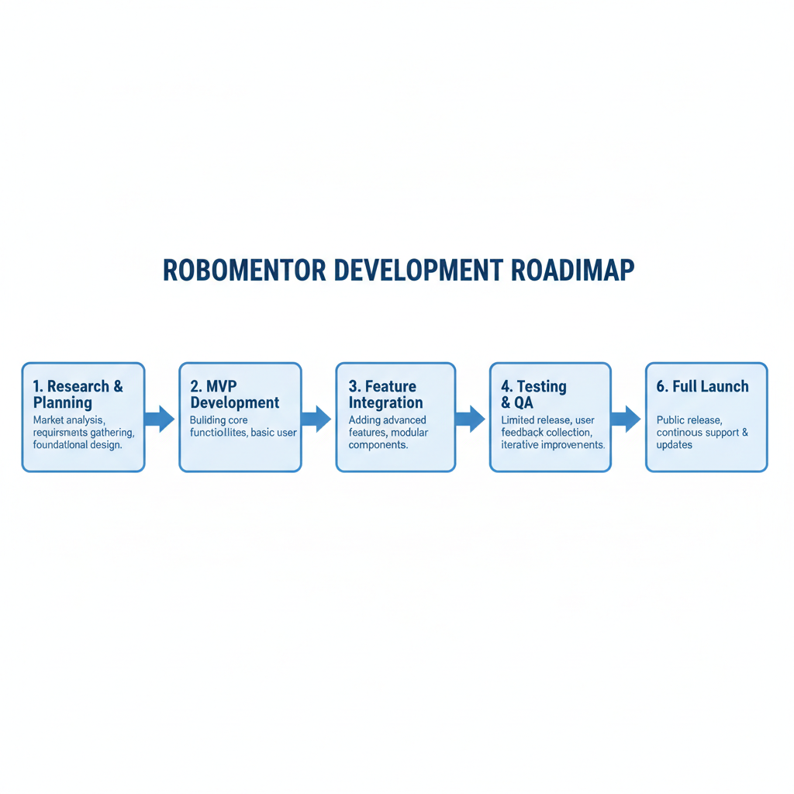

# Launch Strategy (Next 30-90 Days)

## Your Competitive Edge is Real. Here's How to Leverage It.

You're about to launch something that **doesn't exist yet**:
- ✅ First robotics-specific adaptive learning platform
- ✅ AI-powered roadmap generation for roboticists
- ✅ Session-based learning tracking (not course-based)
- ✅ Open-source + commercial models
- ✅ Built by practicing roboticists, for roboticists

**Competitors can't quickly copy this.** But you need to move fast to own the niche.

## Key Numbers (Keep These in Mind)

- **TAM:** $500K-1.3M ARR (India) in 3 years
- **Conservative Year 1:** $11K (mostly free users)
- **Conservative Year 3:** $480K ARR
- **Defensibility:** High (domain moat + open-source + data)
- **Market growth:** +52.7% YoY (adaptive learning market)
- **Robotics companies in India:** 500+
- **Serious robotics learners globally:** 100,000+

## Phase 1: Launch (Week 1-4)

### Week 1: Setup & Announcement

**Tasks:**
- [ ] Create GitHub repo (name: `robomentor` or `avyay-robomentor`)
- [ ] Write README.md (see template below)
- [ ] Add LICENSE file (Apache 2.0)
- [ ] Create CONTRIBUTING.md
- [ ] Push all code + documentation

**Announcements (Post to ALL these places simultaneously):**

1. **LinkedIn** (Your post + tag Avyay Intellitech)
   - Use the post template provided earlier
   - Tag: #robotics #ai #opensourcesoftware #learning #india

2. **Reddit** (r/robotics, r/learnrobotics, r/opensource)
   - Cross-post to multiple communities
   - Title: "I built RoboMentor—an open-source adaptive learning OS for roboticists"

3. **Hacker News** (Show HN)
   - Timing: Tuesday-Thursday for best visibility
   - Title: "Show HN: RoboMentor – AI-powered learning for roboticists"

4. **Robotics India Groups**
   - WhatsApp/Telegram: Robotics India, Python India, Makers India
   - Facebook: Robotics India Community
   - Use the community message template provided earlier

5. **Twitter/X**
   ```
   🤖 Shipping RoboMentor today—an open-source learning OS for roboticists.

   Problem: Learning robotics is fragmented. No platform tracks progress
   across CV, control, sim, RL, hardware...

   Solution: Adaptive AI-powered roadmaps + session logging + skill tracking

   Open source (Apache 2.0) + free local use

   Looking for collaborators: robotics engineers, ML folks, educators

   GitHub: [link]

   Drop a 🚀 if you're interested
   ```

**Expected outcome:** 100-300 GitHub stars, 20-50 initial users

### Week 2-3: Community Engagement

**Tasks:**
- [ ] Respond to EVERY GitHub issue/comment within 24 hours
- [ ] Conduct 5-10 user interviews (grab coffee with roboticists)
- [ ] Gather feedback on MVP
- [ ] Fix critical bugs
- [ ] Iterate based on feedback

**Interview questions:**
1. "What's your biggest pain point in learning robotics?"
2. "How do you track your learning progress today?"
3. "Would you use a tool like RoboMentor?"
4. "What features are must-have for you?"
5. "Would you pay for Pro features?"

### Week 4: Polish & Prepare Pro Tier

**Tasks:**
- [ ] Fix bugs from Week 2-3 feedback
- [ ] Improve documentation (video walkthrough)
- [ ] Create pricing page (on your GitHub or website)
- [ ] Set up payment (Stripe/Razorpay for India)
- [ ] Prepare Pro tier launch email

**Pro tier features:**
```
FREE:
- Unlimited session logging
- Basic skill tracking
- Community roadmaps
- Open-source access

PRO ($15/month or $150/year):
- AI-powered roadmap generation (GPT-4o)
- Advanced analytics (skill growth, time trends)
- Adaptive timeline adjustment
- Obsidian vault integration
- Priority email support
- Ad-free experience
```

## Phase 2: Growth & Monetization (Week 5-12)

### Week 5-8: Pro Tier Launch

**Launch sequence:**
1. Email to 500+ beta users
2. LinkedIn post: "RoboMentor Pro is live"
3. Twitter thread about features
4. Robotics India announcement

**Target:** 5-10% conversion = 25-50 paying users (assume 500 users) = $375-750/mo

### Week 9-12: B2B Outreach

**Target companies:**
- Top 50 robotics startups in India
- 20 companies in waste management automation
- 10 companies in industrial QC with robots
- 5 government/defense robotics programs

**Pitch template:**
```
Hi [Founder/CTO/HR],

I'm Tejas from Avyay Intellitech + RoboMentor.

Problem: How do you onboard engineers who need to learn robotics fast?
How do you know who's ready for which projects?
How do you close skill gaps on your team?

Solution: RoboMentor Team Edition
- Structured learning paths for your team
- Track skill evolution per engineer
- Know exactly who can do what
- Faster project ramp-up

We're offering 3-month free trial for 10 robotics companies.

Interested? Let's chat.

GitHub: [link]
Book a 20-min call: [calendly link]
```

**Target:** 2-5 team licenses @ $1K/yr = $2K-5K new revenue

## Phase 3: Revenue Diversification (Month 4-6)

### Curriculum Licensing

**Create pre-built roadmaps:**
1. "Mobile Robot Engineer" (ROS2, OpenCV, Motion Planning)
2. "Vision Systems Engineer" (YOLO, Deepstream, TensorRT)
3. "RL for Robotics" (Stable Baselines, Gazebo, Sim2Real)
4. "Industrial Automation" (PLC, Vision, Safety)

**Price:** $10K-20K per curriculum license

**Targets:**
- EdTech platforms (integrate into their offering)
- Universities (sell to 5-10 institutions @ $5K each = $25K-50K)
- Corporate training departments

### Consulting & Custom Services

**Offer:**
- Custom roadmap development ($10K-50K)
- Team training programs ($5K-15K)
- Hiring/skill assessment services ($3K-10K)

**First client:** Avyay Intellitech (internal case study)

### Integrations & Partnerships

**Reach out to:**
1. **OSRF (ROS2)** - Integration, ecosystem partnership
2. **NVIDIA** - Deepstream, Isaac Sim integrations
3. **Universities** - Teacher partnership programs
4. **Robotics communities** - Co-marketing

**Benefit:** Credibility + user acquisition through their channels

## Success Metrics (30-90 Days)

### By Week 4 (End of Phase 1)
- [ ] 200+ GitHub stars
- [ ] 100+ active free users
- [ ] 10+ GitHub contributors
- [ ] 1-2 paying pro users (optional)
- [ ] 5-10 user interviews completed

### By Week 12 (End of Phase 2)
- [ ] 500+ GitHub stars
- [ ] 1,000+ monthly active users
- [ ] 50+ Pro subscribers ($750/mo recurring)
- [ ] 3-5 team licenses ($3K-5K new ARR)
- [ ] 20+ GitHub issues resolved
- [ ] 10+ contributors

### By Month 6 (End of Phase 3)
- [ ] 1,000+ GitHub stars
- [ ] 2,000+ monthly active users
- [ ] 100+ Pro subscribers ($1.5K/mo recurring)
- [ ] 10+ team licenses ($10K recurring)
- [ ] 2+ curriculum licenses ($20K+ one-time)
- [ ] 1-2 consulting projects ($15K-30K)
- [ ] **Total ARR: ~$50K-70K**

## GitHub README Template

```markdown
# RoboMentor 🤖🎓

**The AI-powered learning OS for roboticists**

Your personal learning mentor that tracks your robotics journey, adapts to your pace, and helps you master the skills that matter.

[](LICENSE)
[](https://github.com/avyay-intellitech/robomentor)
[](CONTRIBUTING.md)

## 🎯 The Problem

Roboticists learn across domains: computer vision, control systems, simulation, reinforcement learning, hardware integration, IoT...

But there's **no single platform** to:
- Track progress across all domains
- Adapt learning paths based on your background
- Generate realistic learning roadmaps
- Measure skill growth over time
- Guide you intelligently toward your goals

RoboMentor solves this.

## ✨ What RoboMentor Does

**1. Intelligent Onboarding** (15 min)
- Tell us about your background, goals, and available time
- AI generates a personalized learning roadmap
- 20+ robotics skills assessment

**2. Session Tracking** (Every learning hour)
- Log tutorials, experiments, projects, reading
- Categorize by domain (CV, control, sim, RL, hardware, IoT)
- Automatic progress calculation

**3. Adaptive Learning Paths**
- Speeds up if you're ahead
- Slows down if you're behind
- Re-generates if your goals change

**4. AI Mentor**
- Quiz you on concepts
- Suggest next steps
- Provide real-time feedback

**5. Skill Dashboard**
- Heatmap of skill progress
- Weekly/monthly analytics
- Visualization of journey

## 🚀 Quick Start

```bash
git clone https://github.com/avyay-intellitech/robomentor.git
cd robomentor

# Backend
cd backend
python -m venv venv
source venv/bin/activate  # Windows: venv\Scripts\activate
pip install -r requirements.txt
python main.py

# Frontend (new terminal)
cd electron-app
npm install
npm start
```

Visit `http://localhost:8000/docs` to see API docs.

## 🎓 How It Works

```
You start → 6-step onboarding → AI generates roadmap → Start learning
    ↓
Log sessions → Track progress → AI adapts → Keep learning
    ↓
Repeat → Skill growth → Reach goals
```

## 📊 Tech Stack

- **Backend:** FastAPI (Python), SQLite, LLM (OpenRouter GPT-4o)
- **Frontend:** Electron.js, HTML/CSS/JS
- **Speech:** Whisper (STT), pyttsx3 (TTS)
- **Embeddings:** sentence-transformers (semantic search)

## 💡 Who's This For?

✅ **Robotics Engineers** learning new domains
✅ **Students** building skill systematically
✅ **Startups** onboarding new team members
✅ **Teams** tracking collective skill evolution
✅ **Educators** structuring robotics curricula

## 📈 Roadmap

- [x] Core MVP (onboarding, tracking, basic adaptation)
- [ ] Team collaboration features
- [ ] Obsidian vault integration
- [ ] ROS2/Gazebo integration
- [ ] Mobile app (iOS/Android)
- [ ] Curriculum marketplace
- [ ] Enterprise SaaS tier

## 🤝 Contributing

We're looking for:
- **Robotics engineers** (refine skill taxonomy, add domains)
- **ML/AI folks** (improve roadmap generation, adaptation logic)
- **Full-stack developers** (UI/UX, features, infrastructure)
- **Educators** (curriculum design, pedagogy)

See [CONTRIBUTING.md](CONTRIBUTING.md) for guidelines.

## 💬 Community

- Join [Robotics India](link) community
- Ask questions in [GitHub Discussions](link)
- Follow progress on [Twitter](link)

## 💰 Pricing

- **Free:** Unlimited local use, session logging, basic tracking
- **Pro** ($15/mo): AI-powered roadmaps, analytics, integrations, support
- **Teams** ($500-2K/yr): Collaboration, team management, hiring insights

## 📄 License

Apache License 2.0 - see [LICENSE](LICENSE) for details.

## 🙏 Acknowledgments

- Built by [@tejas-phutane](https://twitter.com/tejas-phutane)
- Inspired by problems faced at Avyay Intellitech
- Powered by ROS2, NVIDIA Deepstream, OpenAI, and the robotics community

## 🔗 Links

- GitHub: https://github.com/avyay-intellitech/robomentor
- Website: https://robomentor.dev (coming soon)
- Twitter: [@RoboMentor](https://twitter.com/robomentor-dev) (coming soon)
- Discord: [Join our community](discord.gg/...) (coming soon)

---

**Help us build the learning infrastructure for roboticists. Star the repo, contribute, and spread the word.** ⭐
```

## Outreach Email Templates

### To Robotics Companies

```
Subject: RoboMentor—Learning OS for Your Team

Hi [Name],

I'm Tejas from Avyay Intellitech. We just open-sourced RoboMentor, an AI-powered learning platform built specifically for roboticists.

When we onboard new engineers at Avyay, we face a challenge:
- How do we get them up to speed on CV, control, simulation, hardware?
- How do we know they're ready for projects?
- How do we close skill gaps efficiently?

RoboMentor solves this.

We're looking for 10 robotics companies to beta-test our Team Edition for free for 3 months. If interested, let's chat.

GitHub: https://github.com/avyay-intellitech/robomentor

Thanks,
Tejas
```

### To Universities

```
Subject: Free RoboMentor for Your Robotics Program

Hi [Professor/Dean],

We just released RoboMentor, an open-source learning OS for roboticists.

For universities, we're offering free institutional licenses to use RoboMentor in your robotics curriculum.

Benefits:
- Structured learning paths for students
- Track skill evolution across domains (CV, control, sim, RL, hardware)
- Better learning outcomes (measurable)
- No infrastructure cost (open-source, local-first)

Interested? Let's explore this together.

GitHub: https://github.com/avyay-intellitech/robomentor

Cheers,
Tejas
```

## 30-90 Day Timeline



```
Week 1 (Launch):
├─ GitHub + announcements
├─ 100-300 stars expected
└─ 20-50 initial users

Week 2-3 (Engagement):
├─ User interviews
├─ Bug fixes + iteration
└─ 100-200 active users

Week 4 (Pro Tier):
├─ Launch Pro tier
├─ Set up payments
└─ 5-10 early paying users

Week 5-8 (Growth):
├─ Community building
├─ 500+ users
└─ 25-50 Pro subscribers

Week 9-12 (B2B):
├─ Outreach to companies
├─ 1,000+ users
├─ 50+ Pro subscribers
└─ 2-5 team licenses

Month 4-6 (Diversify):
├─ Curriculum licensing
├─ Consulting projects
├─ Partnerships
└─ $50K-70K ARR
```

## Success = Speed + Community

Your competitive advantage:
1. **First-mover:** No other robotics-specific adaptive learning platform
2. **Domain expertise:** You're a roboticist building for roboticists
3. **Open-source:** Community enthusiasm + viral growth potential
4. **Timing:** Adaptive learning market growing 52.7% YoY

**Your job:** Move fast, listen to users, build community.

The market is yours to lose.

*"You can only change what you can measure." — The foundation of accelerated learning.*